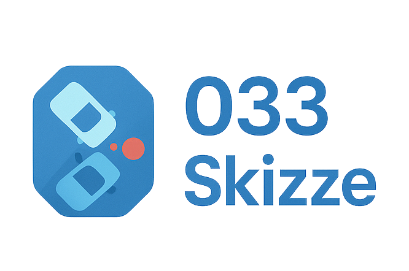

<p align="center">
  
</p>

<h1 align="center">033-Skizze</h1>

<p align="center">
  <strong>Professionelle Verkehrsunfallskizzen für den polizeilichen Einsatz</strong><br>
  <sub>Figma-Style Web-App — offline-fähig, datenschutzkonform, maßstabsgetreu</sub>
</p>

<p align="center">
  <sub>Dieses Repository ist die oeffentliche Projektseite. Der Quellcode des Entwicklungs-Repos bleibt privat.</sub>
</p>

<p align="center">
  
  
  
  
  
  
  
</p>

<p align="center">
  
  
</p>

---

## Was ist 033-Skizze?

Ein spezialisiertes Zeichentool für maßstabsgetreue Verkehrsunfallskizzen. Kombiniert die Bedienbarkeit von Figma/Photoshop mit fachspezifischen Features: normkonforme Straßenquerschnitte, automatische Maßstabsberechnung, Dienststellen-Datenbank und vorkonfigurierte Objektbibliothek.

> **Drei Komplexitätsschichten** — sofort nutzbar mit Defaults, schnell anpassbar über Toggles, voll konfigurierbar für Experten.

---

## Highlights

<table>
<tr>
<td width="50%">

### SmartRoads
Geführter Straßeneditor mit garantierter Korrektheit. Strip-System für Fahrstreifen, Gehwege, Radwege. 6 Presets, RMS-1-konforme Markierungen, interaktive Draufsicht.

</td>
<td width="50%">

### Auto-Header
Automatisch generierter Dokumentkopf aus Metadaten: Dienststelle, Vorgangsnummer, Adresse, Datum, Sachbearbeiter. Live-Rendering auf dem A4-Canvas.

</td>
</tr>
<tr>
<td>

### Dark & Light Mode
Glassmorphism-Design mit vollständigem Light Mode. CSS-Token-System für konsistente Themes. Professionelle Ästhetik in beiden Modi.

</td>
<td>

### Undo/Redo
Intelligentes Undo-System mit Debounce — bündelt schnelle Änderungen zu einem Eintrag. Ctrl+Z/Y, 50-Schritte-History, Flush-before-Undo.

</td>
</tr>
</table>

---

## Features

### Werkzeuge

| Shortcut | Tool | Beschreibung |
|:--------:|------|-------------|
| `V` | **Auswahl** | Einzel-/Mehrfachauswahl, Verschieben, Skalieren, Drehen |
| `P` | **Freihand** | RDP-Glättung, Strichart, Stärke, Farbe |
| `O` | **Formen** | 9 Shapes: Rechteck, Ellipse, Dreieck, Polygon, Stern, Linie, Pfeil, Pfad |
| `T` | **Text** | Inline-Editor, Bold/Italic/Underline, Ausrichtung, Farbe + Hintergrund |
| `M` | **Bemaßung** | DIN-Style Zwei-Klick, automatische Meterangabe |
| `A` | **Ausschnitt** | Druckbereich auf A4 definieren, Frame verschieben/skalieren |

### Tastatur

| Shortcut | Aktion |
|----------|--------|
| `Strg+Z` | Rückgängig |
| `Strg+Y` / `Strg+Shift+Z` | Wiederholen |
| `Strg+D` | Duplizieren |
| `Strg+A` | Alles auswählen |
| `Strg+0` | Ansicht einpassen |
| `Strg+1` | 100% Zoom |
| `Leertaste` | Canvas verschieben (halten) |
| `Shift` | 45°/90°-Snap |
| `Delete` | Löschen |
| `Escape` | Abwählen / Tool zurücksetzen |
| `Rechtsklick` | Kontextmenü |

### Canvas & Viewport

- **DIN A4** — 794 x 1123px, korrektes Seitenformat
- **Infinite Viewport** — Grauer Arbeitsbereich, Spacebar-Pan, Scroll-Zoom, Mittelmaus-Pan
- **25 Maßstabsstufen** — 1:10 bis 1:5000, vollautomatisch berechnet
- **Zoom-Controls** — +/- Buttons, Einpassen, Klick auf % zum Reset

### Metadaten & Dokumentkopf

- **Dienststellen-Suche** — Autocomplete über ~300 niedersächsische Polizeidienststellen
- **Pflichtfeld-Validierung** — Visuelles Feedback bei leeren Pflichtfeldern
- **Auto-Header** — Konva-Rendering: Dienststelle, Adresse, Telefon, Vorgangsnummer, Datum, Sachbearbeiter
- **Unterschriftenblock** — Draggable/resizable, separat vom Header

### Objekt-Bibliothek

| Kategorie | Beispiele |
|-----------|-----------|
| **SmartRoads** | Gerade, Kurve, Kreuzung, Kreisverkehr |
| **Fahrzeuge** | PKW, LKW, Zweirad, Bus, Sonderfahrzeuge |
| **Infrastruktur** | Gebäude, Bordsteine, Leitplanken, Poller |
| **Verkehrsregelung** | Ampeln, Verkehrszeichen, Zusatzzeichen |
| **Umgebung** | Bäume, Hecken, Laternen, Bushaltestellen |
| **Markierungen** | Bremsspuren, Splitterfelder, Kollisionspunkte |

### UX

- **Tooltips** mit Shortcut-Hints auf allen Buttons
- **Kontextmenü** — Rechtsklick: Duplizieren, Löschen, Vordergrund/Hintergrund, Eigenschaften
- **Toast-Benachrichtigungen** — Success/Info/Error mit Auto-Dismiss
- **Ebenen-Manager** — Type-Icons, Drag & Drop Z-Order, Inline-Rename
- **Floating Properties** — Draggbares Modal mit HSV-Color-Picker

---

## Tech Stack

| | Technologie | Zweck |
|---|-------------|-------|
| | **React 19** | Komponentenbasierte UI |
| | **TypeScript 5.9** | Strict Mode Typsicherheit |
| | **Vite 8** | Build-Tool + HMR Dev-Server |
| | **Konva** | Deklaratives Canvas-Rendering |
| | **Zustand + zundo** | State-Management + Undo/Redo |
| | **Tailwind CSS 4** | Utility-First + CSS Custom Properties |
| | **Radix UI** | Accessible Primitives (Dialog, Accordion, ToggleGroup) |
| | **Lucide React** | Konsistente Icon-Bibliothek |
| | **PWA** | Offline-fähig via Precaching |

---

## Projekt-Struktur

```text
src/
├── components/
│   ├── Canvas/              # SketchCanvas, CanvasObjects, PageHeader, ContextMenu
│   ├── Toolbar/             # 6 Tool-Gruppen + PrintAreaTool
│   ├── RightSidebar/        # EbenenPanel, LibraryPanel, MetadataPanel, Dienststellen
│   ├── Inspector/           # FloatingProperties, ColorPicker
│   ├── TopBar/              # Header mit Actions (Undo/Redo, Save, Export)
│   ├── StatusBar/           # Zoom-Controls, Maßstab, Auswahl-Info
│   └── ui/                  # PanelPrimitives, Toast, Tooltip
│
├── smartroads/              # SmartRoads Constrained Editor
│   ├── types.ts             # Strip, Marking, RoadClass
│   ├── constants.ts         # RASt-Defaults, Presets
│   ├── editors/             # StraightEditor
│   ├── rendering/           # SmartRoadCanvasObject, RoadTopView, Strips, Markings
│   └── shared/              # EditorShell, QuickSettings, ElementPalette, Properties
│
├── hooks/                   # useDrawing, useKeyboard, useAusschnitt, useUndoRedo, useToast
├── store/                   # Zustand Store (temporal middleware)
├── constants/               # library.ts, shared.ts
├── types/                   # Core TypeScript-Definitionen
└── utils/                   # scale.ts, snapAngle.ts, objectHelpers.ts, validation.ts
```

---

## Setup

```bash
git clone https://github.com/choboworks/033-skizze.git
cd 033-skizze
npm install
npm run dev
```

Öffnet `http://localhost:5173` im Browser.

| Script | Beschreibung |
|--------|-------------|
| `npm run dev` | Vite Dev-Server mit HMR |
| `npm run build` | TypeScript-Check + Production Build |
| `npm run lint` | ESLint |
| `npm run preview` | Production Preview |

---

## Architektur

### Zwei Objekt-Welten

| | Zeichenobjekte | Reale Objekte |
|---|---|---|
| **Beispiele** | Freihand, Shapes, Text | SmartRoads, Fahrzeuge |
| **Koordinaten** | Page-Pixel (px) | Meter (m) |
| **Skalierung** | Frei per Handles | Parametrisch im Editor |
| **Maßstab** | Irrelevant | Bestimmt Darstellungsgröße |

### State

Single Zustand Store. Canvas, Ebenen-Manager, Properties, Toolbar und SmartRoad-Editor rendern dieselben Daten. Kein Sync nötig. Undo/Redo via zundo Temporal Middleware mit custom Debounce.

---

## Roadmap

- [x] **Phase 1** — Canvas, Viewport, Layout, Theme
- [x] **Phase 2** — Zeichenwerkzeuge, Formen, Text, Bemaßung
- [x] **Phase 3** — SmartRoads, Ausschnitt-Tool, Metadaten, UX
- [ ] **Phase 4** — SmartRoads: Kurven, Kreuzungen, Kreisverkehre
- [ ] **Phase 5** — SVG-Elemente + Objekt-Bibliothek
- [ ] **Phase 6** — Export, Save/Load

---

## Grundsätze

| Prinzip | Umsetzung |
|---------|-----------|
| **Einfachheit** | Drei Schichten: Zero Config → Quick Adjust → Full Custom |
| **Datenschutz** | Null externe Verbindungen. Keine Telemetrie, keine CDN-Fonts |
| **Offline-first** | Nach dem Laden komplett autark. PWA mit Precaching |
| **Maßstabstreue** | Straßenelemente nach RASt 06, RAL 2012, ERA 2010, RMS-1 |

---

<p align="center">
  <sub>Proprietary — <a href="https://github.com/choboworks">choboworks</a></sub><br>
  <sub>React 19 · TypeScript 5.9 · Vite 8 · Konva · Zustand · Tailwind CSS 4</sub>
</p>
